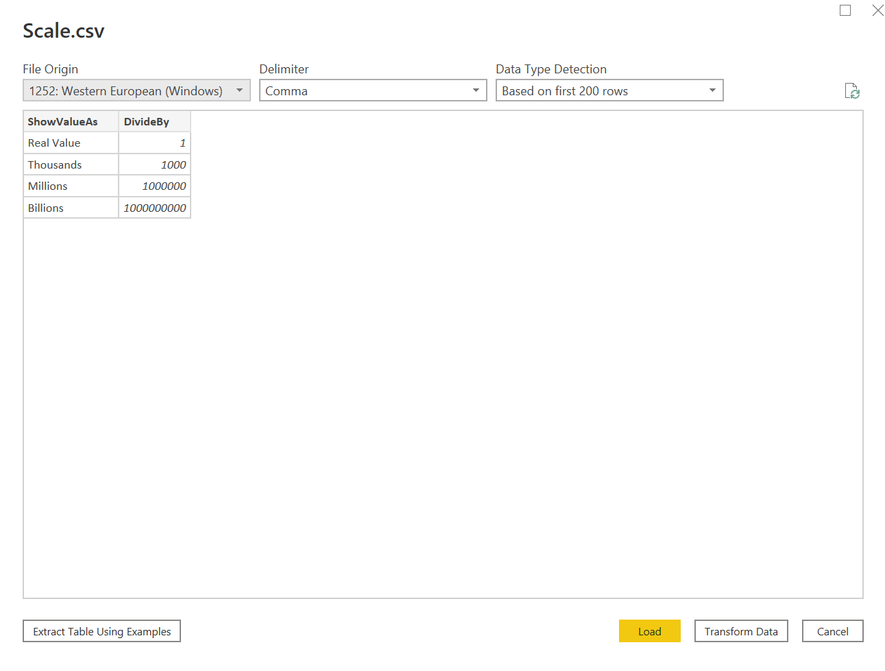
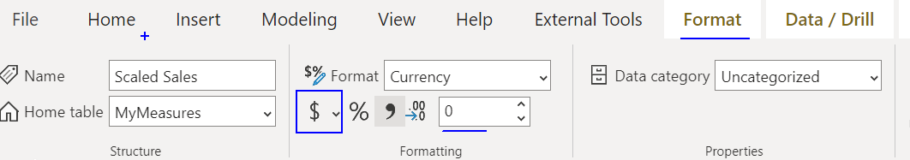

---
lab:
    title: 'Use Parameter Table To Display Amount In Selected Units'
    module: 'Design a Data Model in Power BI'
---


# **Lab 03- Use Parameter Table To Display Amount In Selected Units**

**The estimated time to complete the lab is 45 minutes**

In this lab you will learn to use Parameter Table to display the (sale /any other field) values in 
* Real Value
* Thousands
* Millions
* Billions

**Steps**

1. To open the Power BI Desktop, on the taskbar, click the Microsoft Power BI Desktop shortcut.

 	

1. To close the getting started window, at the top-left of the window, click **X**.

 	

1. To open the starter Power BI Desktop file, click the **File** ribbon tab to open the backstage view.

1. Select **Open Report**.

 	

1. Click **Browse Reports**.

 	

1. In the **Open** window, navigate to the **C:\PowerBI\Labs\03.Using-Parameter-Table-To-Display-In-Specified-Units\Starter** folder.

1. Select the **Sales Analysis** file.

1. Click **Open**.

 	

1. Close any informational windows that may open.

1. To create a copy of the file, click the **File** ribbon tab to open the backstage view.

1. Select **Save As**.

 	

1. If prompted to apply changes, click **Apply**.

 	

1. In the **Save As** window, navigate to the **C:\PowerBI\MySolution** folder, and save the file as **03.Sales Analysis.pbix** as Click **Save**..

 	

Importing The Data

1. Click on Get Data | Text/CSV
Select Scale.csv, from the folder 'C:\PowerBI\Resources',  and it will display the screen as follows

2. Click on Load button, and it will create a Scale table and it will display the screen as follows 


**Creating Measures**
1. Click on Data Pane, and then click on 'Create Table' in the ribbon

and it will appear as follows

Change the expression to be
```
MyMeasures = 
```
and it will appear as follows

Click on Enter Key and table will be created

2. Right Click on My Measures | New Measure, and enter the formula as follows
and enter the formula as follows
```
Scaled Sales = if(
                    HASONEVALUE(Scale[ShowValueAs]),
                    DIVIDE(SUM(Sales[Sales]),SELECTEDVALUE(Scale[DivideBy])),
                    SUM(Sales[Sales])
                )
```
\
3. Select the measure 'Scaled Sales' and Click on Format pane, and specify the currency to be '$ English (United States)' and format to 0 decimal places.


4. Now click on Report pane, and add Matrix visualization 


5. Add the following fields to Matrix Visualization\
a. Rows: Region | Group\
b. Values: Sales | Sales\
c. Values: MyMeasures | Scaled Sales\
and it will appear as follows


6. Now add a slicer to the report, and add field 'ShowValueAs' to the slicer\


7. Click on 'ShowValueAs' field, and from Column Tools, set sort by as 'DivideBy' field\

and slicer will appear as sorted on the basis on Divide By as follows


8. Now, when we make any selection in slicer, according Scaled Sales Amount gets updated in Matrix Report.


9. Right click on MyMeasures | New Measure

and enter the formula as follows
```
Display Unit = "Scaled Sales Unit: " & SELECTEDVALUE(Scale[ShowValueAs]," Real Value")
```
and it will appear as follows\


10. Add a Card visualization, and add Display Unit to it


11. Click on Format icon and hide Category Label 


and specify the size

and it will appear as follows


12. Now, if you change the unit, and same will be reflected, as execpected


